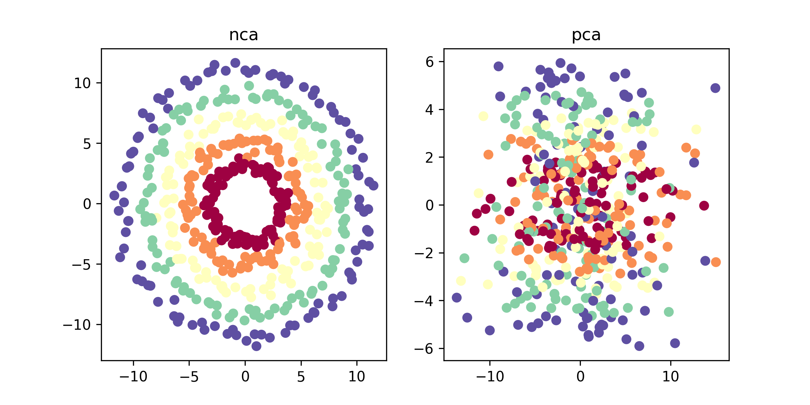

# torchnca

A PyTorch implementation of [Neighbourhood Components Analysis](https://www.cs.toronto.edu/~hinton/absps/nca.pdf) by *J. Goldberger, G. Hinton, S. Roweis, R. Salakhutdinov*.

NCA learns a linear transformation of the dataset such that the expected leave-one-out performance of kNN in the transformed space is maximized.

# Installation

You can install torchnca with pip:

```
pip install torchnca
```

## API

```python
from torchnca import NCA

# instantiate torchnca object and initialize with
# an identity matrix
nca = NCA(dim=2, init="identity")

# fit an torchnca model to a dataset
# normalize the input data before
# running the optimization
nca.train(X, y, batch_size=64, normalize=True)

# apply the learned linear map to the data
X_nca = nca(X)
```

## Dimensionality Reduction

We generate a 3-D dataset where the first 2 dimensions are concentric rings and the third dimension is Gaussian noise. We plot the result of PCA, LDA and NCA with 2 components.

<p align="center">
 
</p>

Notice how PCA has failed to project out the noise, a result of a high noise variance in the third dimension. LDA also struggles to recover the concentric pattern since the classes themselves are not linearly separable.

## kNN on MNIST

We compute the classification error, computation time and storage cost of two algorithms:

* kNN (k = 5) on the raw 784 dimensional MNIST dataset
* kNN (k = 5) on a learned 32 dimensional NCA projection of the MNIST dataset

| Method  | NCA + kNN | Raw kNN     |
|---------|-----------|-------------|
| Time    | 2.37s     | 155.25s     |
| Storage | 6.40 Mb   | 156.8 Mb    |
| Error   | 3.3%      | 2.8%        |
